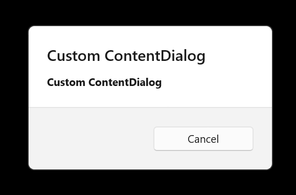
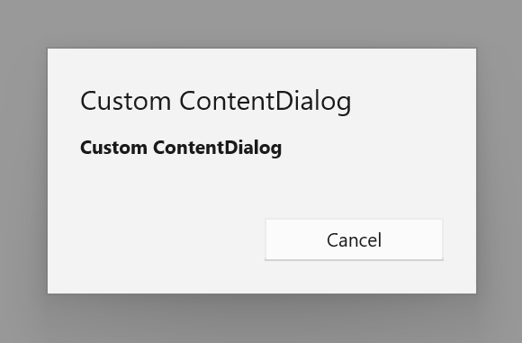

# Dialogs

> [!TIP]
> This article covers Uno-specific information for dialog controls in Uno Platform. For a full description of the feature and instructions on using it, see [Dialog controls | Microsoft Learn](https://learn.microsoft.com/windows/apps/design/controls/dialogs-and-flyouts/dialogs).

* The `Microsoft.UI.Xaml.Controls.ContentDialog` class provides a XAML-based and highly customizable user dialog.
* The `Windows.UI.Popups.MessageDialog` represents a legacy dialog which provides less control over UI.

## Using `ContentDialog`

The recommended way to display user dialogs is via the `Microsoft.UI.Xaml.Controls.ContentDialog` class.

```csharp
ContentDialog noWifiDialog = new ContentDialog
{
    Title = "No wifi connection",
    Content = "Check your connection and try again.",
    CloseButtonText = "Ok"
};

// Make sure to set the XamlRoot!
noWifiDialog.XamlRoot = anyLoadedControl.XamlRoot;

ContentDialogResult result = await noWifiDialog.ShowAsync();
```

It is crucial to set the `XamlRoot` property before calling `ShowAsync`. This way the dialog will become associated with the visual tree. `XamlRoot` can be retrieved from any loaded control in your window (e.g. a `Button`, your `Page`, etc.).

## Customize a `ContentDialog`

You can use various properties to customize its display and also provide a custom XAML-based content for it. For more information, see [ContentDialog Class | Microsoft Learn](https://learn.microsoft.com/windows/windows-app-sdk/api/winrt/microsoft.ui.xaml.controls.contentdialog).

In order for your custom dialog to follow the Fluent design, it's important that you add the following line in the constructor of your dialog:

```csharp
Style = Application.Current.Resources["DefaultContentDialogStyle"] as Style;
```

Your dialog will look similar to this dialog:


If you omit this line, your dialog will look like this:


## Using `MessageDialog`

`MessageDialog` is a legacy API that is no longer officially supported. If possible, please use `ContentDialog` instead.

For existing applications which rely on `MessageDialog`, updating to Uno Platform 5.2 and newer requires you to associate the `MessageDialog` with a window before it is displayed. This can be done via the `WinRT.Interop` APIs:

```csharp
var dialog = new MessageDialog();

// ...

// Get the current window's HWND by passing a Window object
var hwnd = WinRT.Interop.WindowNative.GetWindowHandle(window);
// Associate the HWND with the dialog
WinRT.Interop.InitializeWithWindow.Initialize(dialog, hwnd);

await dialog.ShowAsync();
```

### Using native or XAML-based UI for `MessageDialog`

Uno Platform targets offer two different display modes for `MessageDialog`. To switch between them, you can use the [`UseNativeDialog`](../feature-flags.md#messagedialog).
