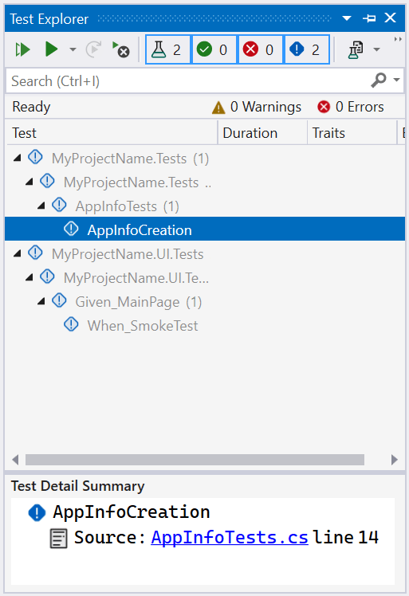

# How-To: Creating an application with tests using Uno.Extensions
 
This tutorial will walk through how to create an Uno application with the `dotnet new` tool, which is already configured to use the Uno.Extensions.
 
## Step-by-steps
 
### 1. Exploring the Solution
 
The generated solution will contain:
 
* *MyProjectName* - for application logic, and other constructs like view models and services, as well as the pages, controls and other views that make up the UI of the application.
* *MyProjectName/Platforms* - platform-specific folders for each supported platform.
* *MyProjectName.Tests* and *MyProjectName.UI.Tests* - for writing unit and UI tests respectively.
* *MyProjectName.Server* - backend server projects.
 
    
 
### 2. Running the Application
 
* Select a target from the drop-down as pictured below
 
    
 
* Click the "play" button, or press F5 to start debugging. The project will be compiled and deployed based on the target platform. For more detailed instructions specific to each platform, refer to the [Debug the App](xref:Uno.GettingStarted.CreateAnApp.VS2022#debug-the-app) documentation.
 
### 3. Running the Unit Tests
 
* Right click the project inside Tests\\MyProjectName.Tests to open the context menu
 
* Select *Run Tests*
 
   The application will be compiled and the test cases will run.
 
> [!TIP]
> If the 'Run Tests' menu item doesn't exist, you need to Rebuild the solution to get Visual Studio to detect the available tests.
 
### 4. Running the UI tests
 
* As demonstrated on step 3, select the **WebAssembly** target from the drop-down.
 
* Press Ctrl + F5 to start the WASM project without debugging.
 
* Once the application is compiled, it will launch inside your default browser. Take note of the URL which should look something like this: https://localhost:5000/Main
 
* Find the project *Tests\\MyProjectName.UI.Tests* and locate the *Constants.cs* file.
 
* Open *Constants.cs* and update the WebAssemblyDefaultUri constant.
 
    It should appear similar to this:
 
    ```cs
    public readonly static string WebAssemblyDefaultUri = "https://localhost:5000/";
    ```
 
* Go back to the project *Tests\\MyProjectName.UI.Tests* and right click. Then, *Run Tests*.
 
    
 
### 6. Running the Server
 
* Set the MyProjectName.Server project as the startup project.
 
* Start the server by pressing F5 which will host your backend services.