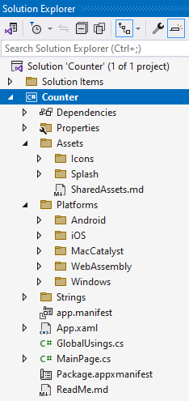

# Counter App using C# Markup and MVVM

[Download the complete C# Markup + MVVM sample](https://github.com/unoplatform/Uno.GettingStartedTutorial/tree/master/src/Counter/CSharp-MVVM)  

[!INCLUDE [Intro](includes/include-intro.md)]

In this tutorial you will learn how to:

- Create a new Project with Uno Platform using Visual Studio Template Wizard or the **dotnet new** command
- Add elements to the C# file, using [C# Markup](xref:Uno.Extensions.Markup.Overview), to define the layout of the application
- Add code to the C# file to implement the application logic using the Model-View-ViewModel (MVVM) pattern
- Use data binding to connect the UI to the application logic

To complete this tutorial you don't need any prior knowledge of the Uno Platform or C#.

[!INCLUDE [VS](includes/include-create.md)]

## [Visual Studio](#tab/vs)

> [!NOTE]
> If you don't have the **Uno Platform Extension for Visual Studio** installed, follow [these instructions](xref:Uno.GetStarted.vs2022).

- Launch **Visual Studio** and click on **Create new project** on the Start Window. Alternatively, if you're already in Visual Studio, click **New, Project** from the **File** menu.

- Type `Uno Platform` in the search box

- Click **Uno Platform App**, then **Next**

- Name the project `Counter` and click **Create**

At this point you'll enter the **Uno Platform Template Wizard**, giving you options to customize the generated application. For this tutorial, we're only going to configure the markup language and the presentation framework.

- Select **Blank** in **Presets** selection

- Select the **Presentation** tab and choose **MVVM**

- Select the **Markup** tab and choose **C# Markup**

Before completing the wizard, take a look through each of the sections and see what other options are available. You can always come back and create a new project with different options later. For more information on all the template options, see [Using the Uno Platform Template](xref:Uno.GettingStarted.UsingWizard).

- Click **Create** to complete the wizard

The template will create a solution with a simple cross-platform project, named `Counter`, ready to run.

## [Command Line](#tab/cli)

> [!NOTE]
> If you don't have the Uno Platform dotnet new templates installed, follow [dotnet new templates for Uno Platform](xref:Uno.GetStarted.dotnet-new).

From the command line, run the following command:

```dotnetcli
dotnet new unoapp -preset blank -presentation mvvm -markup csharp -o Counter
```

This will create a new folder called **Counter** containing the new application.

If you want to discover all the options available in the **unoapp** template, run the following command:

```dotnetcli
dotnet new unoapp -h
```

Also, for more information on all the template options, see [Using the Uno Platform Template](xref:Uno.GettingStarted.UsingWizard).

---

[!INCLUDE [Counter Solution](includes/include-solution.md)]



[!INCLUDE [Main Window](includes/include-mainwindow.md)]

[!INCLUDE [Main Page - C# Markup](includes/include-mainpage-csharp.md)]

[!INCLUDE [Main Page - Layout](includes/include-mainpage-layout.md)]

[!INCLUDE [Main Page - Image](includes/include-image-csharp.md)]

[!INCLUDE [Main Page - Change Layout](includes/include-mainpage-change-layout.md)]

[!INCLUDE [Main Page - Other Elements](includes/include-elements-csharp.md)]

[!INCLUDE [View Model](includes/include-mvvm.md)]

## Data Binding

Now that we have the **`MainViewModel`** class, we can update the **`MainPage`** to use data binding to connect the UI to the application logic.

- Let's add the **`DataContext`** to our page. To do so, add `.DataContext(new MainViewModel(), (page, vm) => page` before `.Background(...)`. Remember to close the **`DataContext`** expression with a `)` at the end of the code. It should look similar to the code below:

    ```csharp
    this.DataContext(new MainViewModel(), (page, vm) => page
        .Background(ThemeResource.Get<Brush>("ApplicationPageBackgroundThemeBrush"))
        .Content(
            ...
        )
    );
    ```

- Update the **`TextBlock`** by removing its current text content and replacing it with a binding expression for the **`Count`** property of the **`MainViewModel`**. Modify the existing **`Text`** property with `() => vm.Count, txt => $"Counter: {txt}"`. The adjusted code is as follows:

    ```csharp
    new TextBlock()
        .Margin(12)
        .HorizontalAlignment(HorizontalAlignment.Center)
        .TextAlignment(Microsoft.UI.Xaml.TextAlignment.Center)
        .Text(() => vm.Count, txt => $"Counter: {txt}")
    ```

- Update the **`TextBox`** by binding the **`Text`** property to the **`Step`** property of the **`MainViewModel`**. The **`Mode`** of the binding is set to **`TwoWay`** so that the **`Step`** property is updated when the user changes the value in the **`TextBox`**.

    ```csharp
    new TextBox()
        .Margin(12)
        .HorizontalAlignment(HorizontalAlignment.Center)
        .TextAlignment(Microsoft.UI.Xaml.TextAlignment.Center)
        .PlaceholderText("Step Size")
        .Text(x => x.Binding(() => vm.Step).TwoWay())
    ```

- Update the **`Button`** to add a **`Command`** property that is bound to the **`IncrementCommand`** property of the **`MainViewModel`**.

    ```csharp
    new Button()
        .Margin(12)
        .HorizontalAlignment(HorizontalAlignment.Center)
        .Command(() => vm.IncrementCommand)
        .Content("Increment Counter by Step Size")
    ```

- The final code for **MainPage.cs** should look like this:

    ```csharp
    namespace Counter;

    public sealed partial class MainPage : Page
    {
        public MainPage()
        {
            this.DataContext(new MainViewModel(), (page, vm) => page
                .Background(ThemeResource.Get<Brush>("ApplicationPageBackgroundThemeBrush"))
                .Content(
                    new StackPanel()
                        .VerticalAlignment(VerticalAlignment.Center)
                        .Children(
                            new Image()
                                .Margin(12)
                                .HorizontalAlignment(HorizontalAlignment.Center)
                                .Width(150)
                                .Height(150)
                                .Source("ms-appx:///Counter/Assets/logo.png"),
                            new TextBox()
                                .Margin(12)
                                .HorizontalAlignment(HorizontalAlignment.Center)
                                .TextAlignment(Microsoft.UI.Xaml.TextAlignment.Center)
                                .PlaceholderText("Step Size")
                                .Text(x => x.Binding(() => vm.Step).TwoWay()),
                            new TextBlock()
                                .Margin(12)
                                .HorizontalAlignment(HorizontalAlignment.Center)
                                .TextAlignment(Microsoft.UI.Xaml.TextAlignment.Center)
                                .Text(() => vm.Count, txt => $"Counter: {txt}"),
                            new Button()
                                .Margin(12)
                                .HorizontalAlignment(HorizontalAlignment.Center)
                                .Command(() => vm.IncrementCommand)
                                .Content("Increment Counter by Step Size")
                        )
                )
            );
        }
    }
    ```

[!INCLUDE [View Model](includes/include-wrap.md)]

If you want to see the completed application, you can download the source code from [GitHub](https://github.com/unoplatform/Uno.GettingStartedTutorial/tree/master/src/Counter/CSharp-MVVM).
