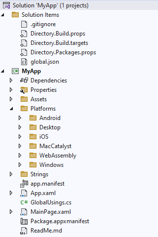

# Solution Structure

This guide briefly explains the structure of an app created with either the [`dotnet new unoapp` template](xref:Uno.GetStarted.dotnet-new) or the [Uno Platform Template Wizard](xref:Uno.GettingStarted.UsingWizard). It is particularly aimed at developers who have not worked with cross-platform codebases before.

## The project files in an Uno Platform app

After creating a new solution called `MyApp`, it will contain the following project:

The `MyApp.csproj` project supports the Mobile (iOS/Android/Mac Catalyst), WebAssembly, Desktop (native macOS, Linux X11/Framebuffer, Windows 7+), and Windows App SDK.

This project contains all the code for your application, alongside platform-specific code found in the `Platforms` folder. Each of these folders is only processed as part of their target environment.

## Further information

See additional guides on handling platform-specific [C# code](platform-specific-csharp.md) and [XAML markup](platform-specific-xaml.md) in an Uno Platform project.

## Next Steps

Learn more about:

- [Uno Platform features and architecture](xref:Uno.GetStarted.Explore)
- [Hot Reload feature](xref:Uno.Features.HotReload)
- [Troubleshooting](xref:Uno.UI.CommonIssues)
- [List of views implemented in Uno](implemented-views.md) for the set of available controls and their properties.
- You can head to [How-tos and tutorials](xref:Uno.Tutorials.Intro) on how to work on your Uno Platform app.
